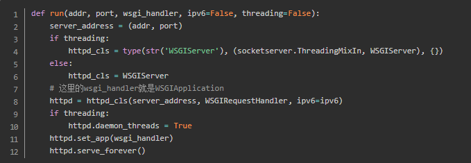
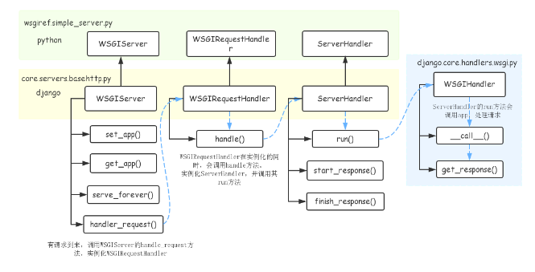
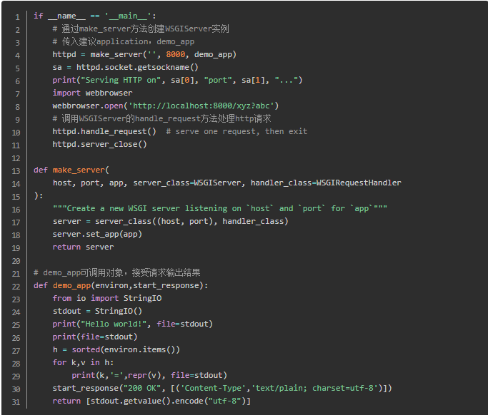
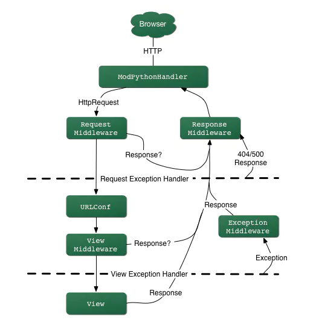

## django WSGI
WSGI: 描述web server与web application通信的规范   
uwsgi: 是uWSIG服务器的独占协议，用于定义传输信息的类型   
uWSIG: 是一个web服务器，实现了WSGI协议、uwsgi协议、http协议等   

例如：uWSGI和Gunicorn都是实现了WSGI server协议的服务器，Django、Flask是实现了WSGI application协议的web框架  

WSGI协议主要包括server和application两部分:   
WSGI server：负责从客户端接收请求，将request转发给application，将application返回的response返回给客户端   
WSGI application：接收server转发的request，处理请求，并将处理结果返回给server   

#### django WSGI application
WSGI application应该实现为一个可调用对象，需要接收两个参数
- 一个字典，该字典包含了客户端请求的信息以及其它信息，可以认为是请求上下文，一般叫做environment（environ、evn）
- 一个用于发送HTTP响应状态（HTTP status）、响应头（HTTP headers）的回调函数

application流程包括：
- 加载所有中间件，以及执行框架相关的操作，设置当前线程脚本前缀，发送请求开始信号
- 处理请求，调用get_response()方法处理请求，该方法的主要逻辑是通过urlconf找到对应的view和callback，按顺序执行各种middleware和callback
- 调用server传入的start_response()方法响应hander与status返回给server
- 返回响应正文

#### django WSGI Server
负责获取http请求，将请求传递给WSGI application，由application处理请求后返回response   
通过runserver运行django项目，在启动时都会调用下面的run方法，创建一个WSGIServer的实例，之后再调用server_forever()方法启动服务

下面表示WSGI server服务器处理流程中关键的类和方法

#### django simple_server
django的simple_server.py模块实现了一个简单的HTTP服务器，整个流程：

<https://www.jianshu.com/p/679dee0a4193>

## django请求响应流程
wsgi.py --> WSGIHandler --> base.BaseHandler(self.load_middleware\(django/core/handlers/base.py)) --> MiddlewareMixin(django/utils/deprecation.py) --> self.get_response(django/core/handlers/base.py)   

- 用户请求会到web服务器
- web服务器会把请求发到django.core.handlers.wsgi的BaseHandler
- 生成request，response，view， exception，template_response中间件链表
- 按中间件配置顺序应用request中间件来处理request，如果这中间生成response，则直接返回
- 通过urlresolvers.resolve匹配请求的url来找到对应的view
- 应用view中间件，如果有response，则直接返回
- 调用对应的view，这个过程和和models进行交互，比如从数据库获取数据等，并渲染模板
- 接着response中间件会被应用来处理repsonse

<https://www.jianshu.com/p/1ff05dfb3d0d>

