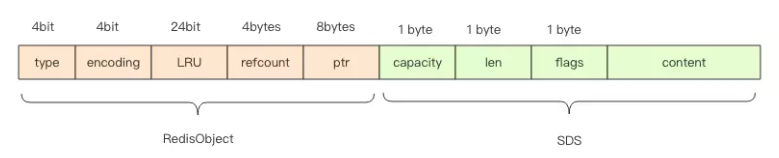
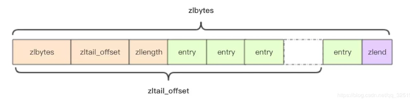
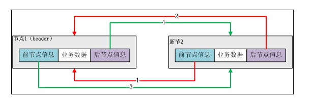
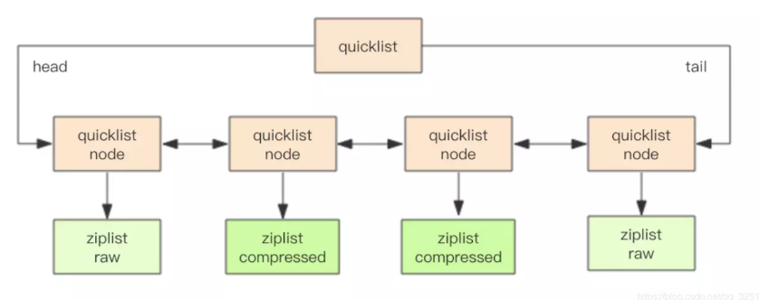
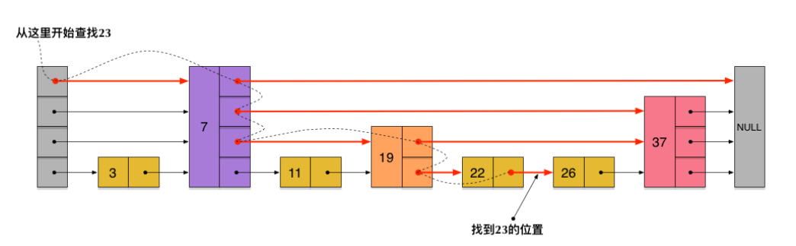

## redis主从同步过程
SYNC   
1、全量同步   
    1）从服务器连接主服务器，发送SYNC命令；   
　　2）主服务器接收到SYNC命名后，开始执行BGSAVE命令生成RDB文件并使用缓冲区记录此后执行的所有写命令；  
　　3）主服务器BGSAVE执行完后，向所有从服务器发送快照文件，并在发送期间继续记录被执行的写命令；  
　　4）从服务器收到快照文件后丢弃所有旧数据，载入收到的快照；  
　　5）主服务器快照发送完毕后开始向从服务器发送缓冲区中的写命令；  
　　6）从服务器完成对快照的载入，开始接收命令请求，并执行来自主服务器缓冲区的写命令；  

2、增量同步  
    Redis增量复制是指Slave初始化后开始正常工作时主服务器发生的写操作同步到从服务器的过程  

PSYNC   
Redis 2.8以后提供了PSYNC优化了断线重连的效率   
PSYNC执行过程中比较重要的概念有3个：runid、offset（复制偏移量）以及复制积压缓冲区   

<https://blog.csdn.net/sk199048/article/details/50725369>
<https://blog.csdn.net/sk199048/article/details/77922589>
<https://www.cnblogs.com/kevingrace/p/5685332.html>

# redis限流
通过限流，在请求数量超出阈值的时候就排队等待甚至拒绝服务   
1、固定窗口法（计数器法）：维护一个单位时间内的计数器 Counter，如判断单位时间已经过去，则将计数器归零   
2、滑动窗口法：时间的推移，时间窗口也会持续移动，有一个计数器不断维护着窗口内的请求数量，这样就可以保证任意时间段内，都不会超过最大允许的请  求数   
3、令牌桶法：固定速率往桶中添加令牌，如果桶中令牌不够，则拒绝新请求   
            限制平均流入速率，允许一定程度的突发请求（支持一次拿多个令牌）   
4、漏桶算法：流入请求速率任意，常量固定速率流出请求。当流入请求数积累到漏桶容量时，则拒绝新请求   
            限制常量流出速率（流出速率是固定值），从而 平滑突发流入速率   

<https://blog.biezhi.me/2018/10/rate-limit-algorithm.html>
<https://juejin.im/post/5e3e75c2e51d4526f3639ae3>

 
## redis数据结构
### LString: SDS(简单动态字符串)

字符串编码类型:  
int编码: 保存的是可以用 long 类型表示的整数值   
raw编码: 保存长度大于44字节的字符串（redis3.2版本之前是39字节，之后是44字节）   
embstr编码: 保存长度小于44字节的字符串（redis3.2版本之前是39字节，之后是44字节）   

embstr和raw都是由redisObject和sds组成的,不同的是：embstr的redisObject和sds是连续的，只需要使用 malloc 分配一次内存；而raw需要为redisObject和sds分别分配内存，即需要分配两次内存   
embstr少分配一次内存，更方便,但embstr也有明显的缺点：如要增加长度，redisObject和sds都需要重新分配内存   

    redisObject  
    struct RedisObject {
        int4 type; // 4bits 
        int4 encoding; // 4bits
        int24 lru; // 24bits
        int32 refcount; // 4bytes = 32bits
        void *ptr; // 8bytes，64-bit system
    }
 

    SDS
    struct SDS {
            unsigned int capacity; // 4byte
            unsigned int len; // 4byte
            byte[] content; // 内联数组，长度为 capacity
         }

为什么会选择44作为两种编码的分界点

64byte - 16byte -3byte -1byte = 44byte
 
### List: quicklist(快速列表)-->ziplist压缩列表、linkedlist双端链表

#### 压缩链表（ziplist）：
当一个列表中只包含少量列表项，且是小整数值或长度比较短的字符串时，redis就使用ziplist（压缩列表）来做列表键的底层实现   
每一个节点之间没有指针的指向，而是多个元素相邻  

压缩列表占用内存少，但是是顺序型的数据结构，插入删除元素的操作比较复杂   
压缩列表适合数据比较小的情况

    struct ziplist<T> {
        int32 zlbytes; // 整个压缩列表占用字节数
        int32 zltail_offset; // 最后一个元素距离压缩列表起始位置的偏移量，用于快速定位到最后一个节点
        int16 zllength; // 元素个数
        T[] entries; // 元素内容列表，挨个挨个紧凑存储
        int8 zlend; // 标志压缩列表的结束，值恒为 0xFF
    }

#### 双端列表（linkedlist）
节点带有prev、next指针、head指针和tail指针，获取前置节点、后置节点、表头节点和表尾节点、获取长度的复杂度都是O(1)  
当数据比较多的时候，双端列表的高效插入删除还是更好的选

#### 快速列表（quicklist）
redis数据结构的选择，时间上、空间上都要达到极致，所以，他们将压缩列表和双端列表合二为一

    快速列表（quicklist）
    rpush: listAddNodeHead ---O(1)
    lpush: listAddNodeTail ---O(1)
    push:listInsertNode ---O(1)
    index : listIndex ---O(N)
    pop:ListFirst/listLast ---O(1)
    llen:listLength ---O(N)

### Hash: ziplist压缩列表、hashtable哈希表
#### hashtable哈希表
hashmap采用了链地址法的方法解决了哈希冲突的问题   

渐进式rehash  
大字典的扩容是比较耗时的,需要重新申请新的数组，然后将字典所有链表中的元素重新挂载到新的数组下面，这是O(n)级别的操作  
搬迁操作埋伏在当前字典的后续指令中（来自客户端的hset、hdel等指令）  
redis还会在定时任务中对字典进行主动搬迁

扩容条件  
当hash中元素的个数等于第一维数组的长度时，就会开始扩容，扩容的新数组是原数组大小的2倍  

缩容条件  
元素个数低于数组长度的10%

### set: intset整数集合、hashtable哈希表
当数据都是整数并且数量不多时，使用intset作为底层数据结构；当有除整数以外的数据或者数据量增多时，使用hashtable作为底层数据结构  
#### intset整数集合
ntset底层实现为有序、无重复数的数组，intset的整数类型可以是16位的、32位的、64位的

### Zset: ziplist压缩列表、skiplist跳表
#### skiplist跳表
skiplist本质上也是一种查找结构，用于解决算法中的查找问题（Searching），即根据给定的key，快速查到它所在的位置（或者对应的value）

##redis持久化
## redis缓存穿透
## Redis集群的一个数据流向
## 如何取消一个过期的键？过期策略内存淘汰
## sorted set实现原理？跳表是如何实现的？
## redis快速原因
## Redis的高可用方案有哪些？分别有什么优缺点呢？
## bitmap是什么数据结构
## redis-cell是什么
## Redis的Cluster，了解原理吗？如果有节点挂了会怎么样？
## HyperLogLog、BloomFilter